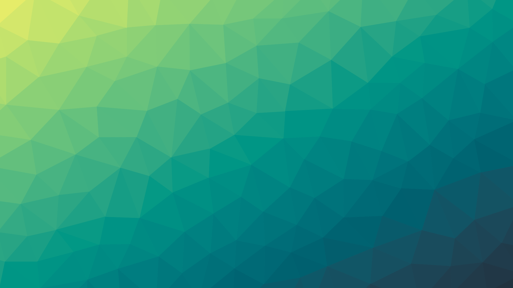

# triangulator2

SVG triangle art generator engine. Similar to [Trianglify](https://github.com/qrohlf/trianglify) but with more point distribution, color scale, and gradient options. An evolution of [this thing I made in 2015](https://github.com/jackw01/Triangulator). Released under the MIT license.



## Install

`npm i triangulator2`

## Usage
```
const Triangulator = require('triangulator2');

const options = {
  isBrowser: false,
  svgInput: false,
  forceSVGSize: true,
  seed: Math.random(),
  width: 1920,
  height: 1080,
  gridMode: this.GridMode.Poisson,
  gridOverridde: false,
  cellSize: 100,
  cellRandomness: 0.3,
  color: this.ColorFunction.DiagonalFromLeft,
  colorScaleInvert: false,
  colorPalette: ['#efee69', '#21313e'],
  colorRandomness: 0.0,
  quantizeSteps: 0,
  colorOverride: false,
  useGradient: false,
  gradient: this.GradientFunction.Random,
  gradientNegativeFactor: 0.03,
  gradientPositiveFactor: 0.03,
  strokeColor: false,
  strokeWidth: false,
};

const svgString = Triangulator.generate(options);
```

#### isBrowser
Set to true when using in a browser environment.

#### svgInput
SVG DOM element to feed to SVG.js (import svgdom and use `svgdom.document.documentElement` for server-side usage).

#### forceSVGSize
If true, sets the size attributes of the SVG. It's necessary to set this to false in order to modify the width and height of an SVG element in a browser environment.

#### seed
Used to seed the random number generator.

### Grid

#### width, height
Set the size of the generated image (points will be drawn outside this size range to guarantee that the bounds will be completely filled).

#### gridMode
One of `Triangulator.GridMode` (`Square`, `Triangle`, `Poisson`, `Override`). Determines how the points are generated. `Square` and `Triangle` generate grids of squares and equilateral triangles, `Poisson` generates a [Poisson disc sampling distribution](https://www.jasondavies.com/poisson-disc/).

#### gridOverride
If `gridMode` is set to `Override`, the array of points (arrays with two items representing x and y) passed into this option will be used to define the triangles.

#### cellSize
Set the approximate spacing between automatically generated points in pixels.

#### cellRandomness
Value between 0 and 1 that determines how much randomness is introduced into the generated points (does not affect `Poisson` mode).

### Colors

#### color
Function that defines how colors are selected from the color scale.

Arguments are normalized (0 to 1) x and y values representing the centroid of a triangle and the return value is a value between 0 and 1 representing the position of the selected color on the scale.

Built-in color functions are in `Triangulator.ColorFunction`:
```
Horizontal: (x, y) => x,
Vertical: (x, y) => y,
DiagonalFromLeft: (x, y) => (x + y) / 2,
DiagonalFromRight: (x, y) => (1 - x + y) / 2,
RadialFromCenter: (x, y) => Math.hypot(x - 0.5, y - 0.5) * Math.sqrt(2) * 1.1,
RadialFromBottom: (x, y) => Math.hypot(x - 0.5, y - 1.5) - 0.5,
FromEdges: (x, y) => edgeDist(x, y) * 0.3 + (1 - Math.hypot(x - 0.5, y - 0.5) * Math.sqrt(2)) * 0.7,
Noise: (sx, sy) => (x, y) => noiseGenerator.noise(x * sx, y * sy, 0),
```

#### colorScaleInvert
If true, inverts the direction of the color scale.

#### colorPalette
Array containing the colors that make up the color packet, in hex string format.

#### colorRandomness
Value between 0 and 1 that determines how much randomness is introduced into the selected colors.

#### quantizeSteps
If nonzero, generated color positions will be quantized into this many steps.

#### colorOverride
If a function is passed here, the default color selection will be bypassed. A `colorOverride` function must accept normalized x and y values representing the centroid of a triangle as arguments and return a color as a hex string.

### Gradient

#### useGradient
If true, triangles will be filled with gradients instead of solid colors.

#### gradient
Function that defines how the gradient in each triangle is oriented.

Arguments are an array containing the points in a triangle and normalized x and y values representing the centroid. The return value must be an object containing properties `gradientVector` and `gradientDirection`, a normalized vector in quadrant 1 representing the overall direction of the gradient and a direction value (-1 or 1).

Currently only one built-in gradient function is implemented in `Triangulator.GradientFunction`:
```
Random: (triangle, x, y) => {
  const i = Math.floor(rng() * 3);
  const p2 = triangle[(i + 1 + Math.floor(rng() * 2)) % 3];
  const vector = [p2[0] - triangle[i][0], p2[1] - triangle[i][1]];
  const gradientDirection = Math.sign(vector[0] * vector[1]);
  let gradientVector = vector.map(a => Math.abs(a));
  gradientVector = gradientVector.map(a => a / Math.max(...gradientVector));
  return { gradientVector, gradientDirection };
},
```

#### gradientNegativeFactor, gradientPositiveFactor
These values determine how much influence the gradient has on the color selection in each direction along the color scale.

### Stroke

#### strokeColor
Stroke color for all triangles as a hex string.

#### strokeWidth
Stroke width.
